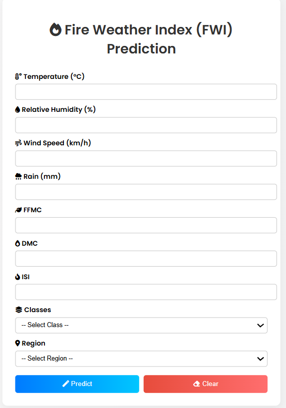

## Fire Weather Index (FWI) Prediction - Flask Web App

This project is a Flask-based web application that predicts the **Fire Weather Index (FWI)** using Ridge Regression. It provides a user-friendly interface where users can input environmental factors like temperature, humidity, wind speed, etc., and receive a predicted fire risk level.

## Features

-  9 Input Fields (Temperature, RH, Wind, Rain, FFMC, DMC, ISI, Classes, Region)
-  Ridge Regression ML model for prediction
-  Scaled input using StandardScaler
-  Responsive UI with input validation
-  "Clear" button for new entries
-  Instant prediction display without losing input data

## Screenshot

 


## Tech Stack

- **Python** (Flask)
- **HTML + CSS + JavaScript**
- **scikit-learn**
- **Bootstrap-inspired UI**
- **Git & GitHub**

## How to Run Locally

```bash
# Clone the repository
git clone https://github.com/sanhith25/flask-fwi-project.git
cd flask-fwi-project

# Optional: create a virtual environment
python -m venv venv
venv\Scripts\activate  # or source venv/bin/activate on Mac/Linux

# Install dependencies
pip install -r requirements.txt

# Run the Flask app
python application.py

FLASK_PROJECT/
│
├── application.py
├── README.md
├── requirements.txt
│
├── venv/ # Virtual environment (should be in .gitignore)
│
├── models/ # Contains the trained model and scaler
│ ├── ri.pkl
│ └── scalar.pkl
│
├── templates/ # HTML templates for Flask
│ ├── home.html
│ └── index.html
│
├── notebooks/ # Google colab notebooks and datasets
│ ├── algerian-forest-dataset.ipynb
│ └── algerian-forest-dataset-update.csv
│
├── images/ # Optional assets/screenshots
│ └── web page.png
